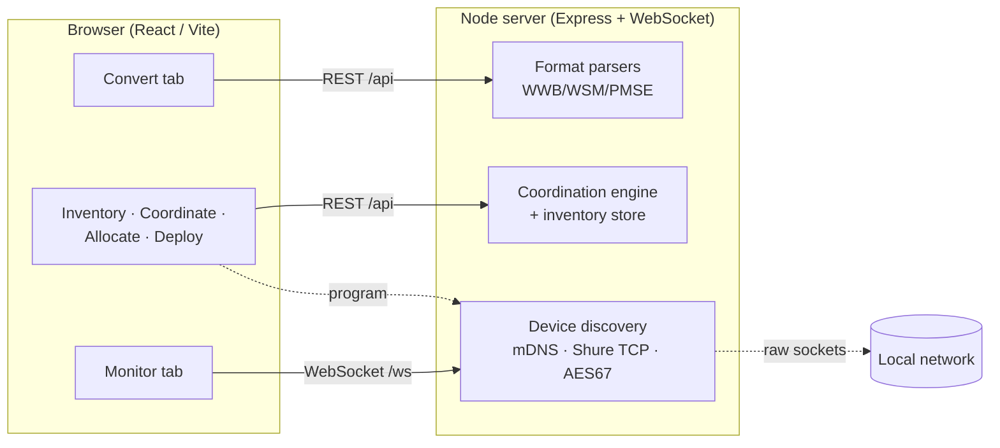

# RFutils

> **AI-assisted project.** This codebase was created with [Claude Code](https://claude.com/claude-code)
> (Anthropic), directed and reviewed by a human author. It merges three earlier tools into one
> package; several of the underlying formats and protocols are reverse-engineered from real exports
> and vendor gear rather than official schemas (neither Shure nor Sennheiser publish full specs for
> most of these). **Verify every export against your own WWB/WSM install, and check experimental
> outputs carefully, before relying on any of this for a live show.**

A browser-based RF-coordination and wireless-mic suite that unifies three separate tools into one
package, with room to grow into full frequency coordination, allocation, and deployment services:

[](https://www.youtube.com/watch?v=8f6VZ9qt1kw)

*A 50-second tour. Every frame is the real application: a genuine 291-channel Wireless Workbench
report goes into Convert, and the eight frequencies in Coordination are computed live. The
receivers in Monitor are the app's mock devices — no wireless rack was attached.*

| Merged tool | What it did | Where it lives now |
|---|---|---|
| [wsm-wwb-bridge](https://github.com/stoatworks-labs/wsm-wwb-bridge) | Move coordination data between Shure Wireless Workbench (WWB) and Sennheiser Wireless Systems Manager (WSM), plus any CSV | **Convert** (drop the file) |
| [pmse-to-wwb](https://github.com/stoatworks-labs/pmse-to-wwb) | Convert an Ofcom PMSE licence schedule PDF into WWB import files | **Convert** (drop the PDF) |
| [MicWizard](https://github.com/stoatworks-labs/MicWizard) | Discover networked Shure/Sennheiser/AES67 receivers and monitor audio / battery / RF | **Monitor** |



Everything routes through **one internal channel model** (`packages/shared`), so any supported input
can be re-exported as any supported output, and the same model feeds coordination, allocation, and
deployment.


<!-- downloads:start -->

## Download

**[v0.4.3](https://github.com/stoatworks-labs/RFutils/releases/tag/v0.4.3)** — prebuilt for macOS, Windows and Linux. Pick your platform:

<details>
<summary><b>macOS</b> — Apple Silicon, Intel</summary>

| Build | Download | Size |
| --- | --- | --- |
| Apple Silicon · .dmg disk image | [`rfutils-0.4.3-macos-aarch64.dmg`](https://github.com/stoatworks-labs/RFutils/releases/download/v0.4.3/rfutils-0.4.3-macos-aarch64.dmg) | 40 MB |
| Apple Silicon · .dmg disk image | [`RFutils_0.4.3_aarch64.dmg`](https://github.com/stoatworks-labs/RFutils/releases/download/v0.4.3/RFutils_0.4.3_aarch64.dmg) | 40 MB |
| Intel · .dmg disk image | [`rfutils-0.4.3-macos-x86_64.dmg`](https://github.com/stoatworks-labs/RFutils/releases/download/v0.4.3/rfutils-0.4.3-macos-x86_64.dmg) | 41 MB |
| Apple Silicon · .pkg installer | [`rfutils-0.4.3-macos-aarch64.pkg`](https://github.com/stoatworks-labs/RFutils/releases/download/v0.4.3/rfutils-0.4.3-macos-aarch64.pkg) | 40 MB |
| Intel · .pkg installer | [`rfutils-0.4.3-macos-x86_64.pkg`](https://github.com/stoatworks-labs/RFutils/releases/download/v0.4.3/rfutils-0.4.3-macos-x86_64.pkg) | 41 MB |

</details>

<details>
<summary><b>Windows</b> — x64</summary>

| Build | Download | Size |
| --- | --- | --- |
| x64 · .exe installer | [`RFutils_0.4.3_x64-setup.exe`](https://github.com/stoatworks-labs/RFutils/releases/download/v0.4.3/RFutils_0.4.3_x64-setup.exe) | 27 MB |
| x64 · .msi installer | [`RFutils_0.4.3_x64_en-US.msi`](https://github.com/stoatworks-labs/RFutils/releases/download/v0.4.3/RFutils_0.4.3_x64_en-US.msi) | 41 MB |

</details>

<details>
<summary><b>Linux</b> — x64</summary>

| Build | Download | Size |
| --- | --- | --- |
| x64 · .deb package (Debian/Ubuntu) | [`RFutils_0.4.3_amd64.deb`](https://github.com/stoatworks-labs/RFutils/releases/download/v0.4.3/RFutils_0.4.3_amd64.deb) | 43 MB |
| x64 · .rpm package (Fedora/RHEL) | [`RFutils-0.4.3-1.x86_64.rpm`](https://github.com/stoatworks-labs/RFutils/releases/download/v0.4.3/RFutils-0.4.3-1.x86_64.rpm) | 43 MB |

</details>

Also in this release:

- [`rfutils-node-bundle.tar.gz`](https://github.com/stoatworks-labs/RFutils/releases/latest/download/rfutils-node-bundle.tar.gz) — Node bundle (run it yourself), 513 KB

All builds, checksums and release notes: [github.com/stoatworks-labs/RFutils/releases](https://github.com/stoatworks-labs/RFutils/releases).

macOS builds are signed and notarised and open normally. The Windows builds are unsigned, so SmartScreen warns once — see [Windows SmartScreen & Defender Firewall](#windows-smartscreen--defender-firewall) for the one-time click-through.

<!-- downloads:end -->

## Try it without installing anything

The conversion and coordination half of RFutils runs entirely in a browser, hosted at
**<https://rfutils.stoatworks-labs.com>**. Drop in a WWB/WSM export or an Ofcom PMSE licence PDF
and get your files back — **nothing is uploaded**: the parsers, the `.shw` generator and the
coordination engine all execute on your own machine, in the page. Your licence PDF never leaves
your laptop.

The hosted build has **Convert, Coordination, Inventory and Allocation**. It does not have
**Monitor** or **Deployment**: discovering receivers (mDNS), decoding AES67 audio and programming
frequencies over TCP need sockets a web page cannot open. For those, run RFutils locally.

## Architecture

An npm-workspaces monorepo:

- **`packages/shared`** — the internal data model and wire types (`Channel` / `CoordinationList`,
  PMSE `Assignment`, `DiscoveredDevice`, the WebSocket protocol) **and all the pure logic**: the
  WSM/WWB/CSV parsers and writers (`shared/formats`), the PMSE PDF parser, exporters and `.shw`
  generator (`shared/pmse`), and the coordination engine (`shared/coordination`). None of it
  touches a Node API, which is what lets the same code run on the server and in the browser.
- **`packages/server`** — a Node ([Express](https://expressjs.com) + [ws](https://github.com/websockets/ws))
  server. It exposes the shared logic over `/api` **and** owns the raw sockets a browser can't
  open: mDNS, Shure's TCP command protocol, and AES67/SAP multicast.
- **`packages/web`** — the React/Vite single-page app (ported from MicWizard's renderer plus new
  conversion UI). Built twice: against the server (`npm run build`), and standalone for hosting
  (`npm run build:static`), where `src/localApi.ts` calls the shared logic directly instead of
  `fetch('/api/…')`.

The two file tools were originally Python (a tkinter desktop app and a FastAPI service); their
parsers were ported to TypeScript and checked against the original tools' output on real sample
files (see `packages/server/scripts/verifyParsers.ts`). MicWizard's networking was already
TypeScript and moved from its Electron main process into this server largely intact.

## Running it

Requires Node 18+ (developed against Node 22/26).

```bash
npm install
npm run dev          # server on :8420, web on :5273 (Vite proxies /api and /ws to the server)
```

Then open http://localhost:5273.

For a production build served from a single port:

```bash
npm run build
npm start -w @rfutils/server   # serves the built UI + API on :8420
```

Other scripts: `npm run typecheck` (all packages), `npm test` (server parser tests),
`npm run dev:demo` (like `dev`, but seeds simulated receivers so the Monitor tab is populated
without any hardware — how the Monitor screenshot above was captured).

To build the browser-only version:

```bash
npm run build:static     # -> packages/web/dist-static
npm run preview:static   # serve that build locally
```

It is published to a **static-assets-only Cloudflare Worker** (`wrangler.toml`, worker
`rfutils`, serving `packages/web/dist-static`):

```bash
npm run build:static
cf-run npx wrangler deploy
```

**`wrangler deploy` runs no build.** It uploads `packages/web/dist-static` exactly as it
finds it, so the build has to come first — skip it and the deploy reports a clean success
while republishing the previous build.

The build targets a root base path, since the worker serves at the root of its own domain.
Set `RFUTILS_BASE=/somewhere/` to host it under a subdirectory instead.

### Environment

- `RFUTILS_SERVER_PORT` — server port (default `8420`).
- `RFUTILS_DISABLE_MONITOR=1` — skip network device discovery (file conversion still works).
- `RFUTILS_MOCK_DEVICES=1` — seed simulated receivers into the Monitor dashboard (demo/dev).
- `RFUTILS_CONFIG_DIR` — where `companion-routes.json` is read from (default `~/.rfutils`).
- `RFUTILS_CAPTURE_DEVICE` / `_FORMAT` / `_CHANNEL` / `_RATE`, `RFUTILS_FFMPEG`,
  `RFUTILS_CAPTURE_CMD`, `RFUTILS_CUE_BUS_DEVICE` / `_CHANNEL`, `RFUTILS_CUE_SRC_DEVICE` — audio
  capture (DVS/Dante interface) cue mode; see [Audio cueing](#audio-cueing-to-headphones).

### Desktop app

Prefer not to touch the terminal? A small menu-bar app lets you pick the network
interface + port, Start/Stop the server, and open the web UI. It's **fully
self-contained** — the `.dmg` embeds a Node runtime plus the whole app (server +
built web UI), so nothing needs to be installed, not even Node. Grab it from
[Releases](https://github.com/stoatworks-labs/RFutils/releases), or see
[launcher/](launcher/) to build it. The `.dmg` is **unsigned** — see
[Unsigned builds](#unsigned-builds--gatekeeper-smartscreen--defender-firewall)
for first-launch and firewall notes. If you ever get an Apple Developer account,
[launcher/SIGNING.md](launcher/SIGNING.md) shows how to turn signing on; until
then it's not needed.

<p align="center"></p>

## Convert

One drop zone takes everything below. RFutils reads the file's own bytes to decide what it is
— a PDF goes to the Ofcom licence parser, anything else to the coordination-file detector — so
there is nothing to select first, and a licence dragged straight out of an email with no
extension still lands in the right place.

### Coordination files (WSM · WWB · CSV)

Drop a file and RFutils auto-detects its shape, previews the parsed channels, and lets you
re-export to any supported format:

**Reads:** Shure `.shw` / `.cws` (native WWB XML), Sennheiser `.wsm` project files, WSM HTML
"Coordination Report", WSM Frequencies/Bands CSV, WWB Coordination Report CSV, a bare frequency
list, or any other CSV via a column-mapping dialog — which appears even when none of the
headers could be guessed, so an unfamiliar spreadsheet is a mapping away rather than a dead end.

**Writes:** WWB frequency list (`.txt`, the safe documented import format), WWB inventory CSV,
WSM Frequencies/Bands CSV, a generic CSV, or an experimental WWB7 `.shw` show file.

### Ofcom PMSE licence (PDF)

Drop an Ofcom PMSE licence schedule PDF into the same zone to generate a WWB frequency list
(`.txt`), a reference sheet (`.csv`) mapping frequencies to suggested names and coordination
groups, and an experimental `.shw` show file.


*Screenshot uses a synthetic licence with invented details — not a real licence.*

> **PDF parsing.** The original `pmse-to-wwb` used Python's `pdfplumber` for table detection.
> `pdfjs-dist` has no table detector, so this port buckets positioned text into the fixed Ofcom
> ST16 template's columns (scaled by page width) and merges the multiple physical lines per row.
> It's been validated against a real Ofcom PMSE licence schedule — all 116 assignments,
> frequencies, sites, periods, fees and header metadata parse correctly. The column geometry is
> calibrated to that fixed template; a materially different Ofcom template revision would need
> re-calibration, so it's still wise to sanity-check the parsed assignments against the source PDF.

> ⚠️ The `.shw` show file (both here and in the coordination exporter) is reverse-engineered from a
> single real WWB7 file and unvalidated by Shure. Open it in Wireless Workbench and check it before
> relying on it for a real show; when in doubt, use the frequency list.

## Monitor

Live discovery and metering of wireless receivers on the local network — Shure (TCP command
strings, port 2202), Sennheiser (SSC), and AES67/Dante (mDNS + SAP), with per-channel audio,
battery, and RF telemetry pushed to the browser over WebSocket.


*Screenshot captured with `RFUTILS_MOCK_DEVICES=1` (simulated receivers) — no real hardware was on the network. The highlighted headphone button on an AES67 channel is an active audio cue.*

> **Not yet hardware-tested.** As in MicWizard, the vendor protocol adapters are built from a mix of
> public documentation and best-effort reverse engineering and have not been validated against real
> receivers. The Sennheiser SSC adapter in particular is a skeleton.
>
> This is unchanged by [`docs/SHURE-ACN.md`](docs/SHURE-ACN.md), which *is* built from real Shure
> QLXD4 hardware — but documents a **different protocol** (ANSI E1.17 / ACN, the path a Yamaha
> console uses when a receiver is mounted on it), not the Command Strings interface these adapters
> speak. Real gear was on the network, and it still didn't test this code.

**Got gear we don't support?** Wisycom, Sony DWX, Sound Devices and MiPro all have real network
control protocols that nobody has published — and the Lectrosonics adapter is already written and
waiting on [one file's worth](packages/server/src/monitor/discovery/lectrosonicsProtocol.ts) of
correct wire format. Five minutes of a receiver doing something ordinary, recorded with Wireshark,
is enough to start from. **[docs/capture-guide.md](docs/capture-guide.md)** walks through it: for
most people it's "run Wireshark on the same laptop as the vendor software" and nothing else, and
there's a mirror-port recipe for the cases where it isn't. See [`docs/BRANDS.md`](docs/BRANDS.md)
for what's supported today.

There's a 57-second video on why, covering this project and
[Dante-BabelBox](https://github.com/stoatworks-labs/Dante-BabelBox) together:
**[Send us a capture](https://www.youtube.com/watch?v=E-gjYZoHVAw)**.

### Audio cueing to headphones

A browser can't join a Dante/AES67 multicast group directly, so cueing to headphones works by
**relay**: the server sends the one cued channel to the browser as PCM16 mono over a dedicated
binary WebSocket (`/ws/audio`), and an `AudioWorklet` ring buffer plays it out with a small jitter
buffer. Only the cued channel is streamed (~0.77 Mbit/s at 48 kHz), and only one is cued at a time,
like a hardware PFL/cue bus. There are two ways to get the audio into the server:

**1. Capture mode — a Dante interface (DVS) + Companion (recommended).** Let a vendor Dante
endpoint do the decode and let Companion do the routing:

```
Mic TX ──(Dante)──▶ [Companion re-points one crosspoint] ──▶ DVS / Dante interface "cue" Rx channel
                                                                       │  (local audio device)
                                                                       ▼
                                    RFutils server captures that channel with ffmpeg ──PCM16/WS──▶ browser 🎧
```

Clicking 🎧 on any channel best-effort asks Companion to route it to the cue-bus destination, then
streams the captured bus. This offloads the Dante decode to supported vendor software and reuses the
Companion integration below. Enable it by pointing the server at the interface's input:

- `RFUTILS_CAPTURE_DEVICE` — ffmpeg input device (e.g. `":2"` for an avfoundation index on macOS;
  list devices with `ffmpeg -f avfoundation -list_devices true -i ""`). Setting this switches the
  app into capture mode, and **every** channel becomes cueable.
- `RFUTILS_CAPTURE_FORMAT` — ffmpeg input format (default `avfoundation`/`dshow`/`alsa` by OS).
- `RFUTILS_CAPTURE_CHANNEL` — 0-based input channel to use as the cue bus (default `0`).
- `RFUTILS_CAPTURE_RATE` — sample rate (default `48000`); `RFUTILS_FFMPEG` — ffmpeg path.
- `RFUTILS_CAPTURE_CMD` — full override: any command emitting `s16le` mono to stdout (bypasses the
  ffmpeg args above). `npm run dev:capture-demo` uses this with a `sox` test tone.
- `RFUTILS_CUE_BUS_DEVICE` / `RFUTILS_CUE_BUS_CHANNEL` — the Dante Controller destination Companion
  routes mics to (the DVS Rx channel the server captures). Without these, cueing just streams the
  bus and you route manually. The source name sent to Companion is the discovered channel's name
  (override the device with `RFUTILS_CUE_SRC_DEVICE`); **these must match your Dante Controller
  labels** for auto-routing to hit the right crosspoint. ffmpeg needs installing (`brew install
  ffmpeg`). A fast/bursty source is throttled to real time by a server-side pacer.

**2. Direct AES67 mode (default, no config).** If no capture device is set, the server decodes
AES67 multicast itself and 🎧 plays that channel's own audio. Cueable **AES67 channels only** —
Shure/Sennheiser command protocols carry telemetry, not audio, and native-only Dante still needs
Audinate's SDK, so a Dante device must be in AES67 mode.

**Both modes** share the same PCM16/WebSocket/AudioWorklet playback path, verified end-to-end with a
synthetic tone (the browser analyser reads the expected level) — direct mode via
`RFUTILS_MOCK_DEVICES`, capture mode via `dev:capture-demo`. Latency is ~100–200 ms (fine for
identifying a mic, not for sample-accurate work); lower-latency Opus/WebRTC transport is a natural
future upgrade. The real-Dante decode / capture-device paths remain hardware-untested.

### Dante routing via Companion (optional)

Off by default. To route Dante crosspoints from the Monitor tab, run your own
[Bitfocus Companion](https://bitfocus.io/companion) with a single "Make Crosspoint" button wired to
`companion-module-audinate-dantecontroller`, then copy `companion-routes.example.json` to
`~/.rfutils/companion-routes.json` (or `$RFUTILS_CONFIG_DIR`). RFutils just sets four Companion
custom variables and presses your button — it has no Dante integration of its own, and full Dante
API control still requires Audinate's SDK (see `packages/server/src/monitor/audio/danteApi.ts`).

## Coordinate

Compute a set of mutually-compatible frequencies. Pick an **equipment profile** (Shure, Sennheiser,
Wisycom, Lectrosonics, Audio-Technica, Sony …), then the **frequency band variant you actually
own** — a ULX-D G51 (470–534) coordinates differently from an H50 (534–598) — and the **operating
mode**, because required spacing is a property of the mode, not the product: Shure Axient Digital
wants 350 kHz in standard mode and 125 kHz in High Density, Sennheiser EW-DX 600 kHz standard and
300 kHz in Link Density. A **band preset** (UK Ch38, UK/US UHF core, Ch70, 2.4 GHz …) still covers
the separate question of what your licence allows.

Those numbers are quoted from manufacturer documentation, and the app shows you which is which:
each figure is labelled *from the manufacturer's documentation*, *calculated from published
figures*, or *no source — assumed, verify before a show*, with the URL it came from. Shure,
Sennheiser, Lectrosonics and Wisycom are researched; the rest of the catalog still carries
placeholders and says so. See [`packages/shared/src/rf/`](packages/shared/src/rf/).

Three consequences worth knowing:

- **Occupied bandwidth is not the spacing to coordinate at.** A PSM 1000 occupies ~175 kHz but
  Shure's own compatible-frequency count implies ~1.85 MHz of separation. Both are shown.
- **Bands with gaps are respected.** Axient Digital G55, G57, K53, K54 and Shure P55, SLX-D J52
  and M55, Sennheiser U1/5 and every Wisycom MCR54 version are discontiguous — nothing is placed
  in a gap the radio cannot tune.
- **Sennheiser digital gear is placed on an equidistant grid**, not by IM search, because that is
  how the vendor designed it to be deployed.

Mixed rigs coordinate correctly: between any two radios the wider of the two spacing requirements
applies, each radio keeps its own tuning raster (Wisycom is 5 kHz, not 25), and occupied bandwidths
are never allowed to overlap. The catalog is user-extensible via `~/.rfutils/profiles.json`.

Then set how many you need and the IM options; the engine builds each radio's candidate grid
(its band ∩ your ranges, minus exclusions + guard) and places
carriers that are adequately spaced and free of third-order (`2·f1−f2`, `f1+f2−f3`) and optional
fifth-order (`3·f1−2·f2`) intermodulation products landing on any carrier. Lock existing
frequencies to coordinate around them, re-check the result for conflicts, and export straight to
any WWB/WSM format. Works on an integer-kHz raster and is deterministic (seeded), so a given request
always reproduces. See [`coordination/engine.ts`](packages/shared/src/coordination/engine.ts).


## Inventory, Allocate & Deploy

The suite carries a plan end to end:


- **Inventory** — build your equipment list by hand or import it from live-discovered devices;
  it's persisted server-side (`~/.rfutils/inventory.json`) and drives how many channels coordination
  places. See [`inventory/store.ts`](packages/server/src/inventory/store.ts).
- **Allocation** — pair coordinated frequencies with talent / inventory channels (auto-populated
  from the last coordination, or coordinated straight from the inventory), then export any format.
- **Deployment** — bind allocations to live receiver channels and program them, or export files for
  offline programming. Live programming uses Shure command strings (`SET … FREQUENCY`) and is
  **dry-run by default** — it shows the exact strings before anything is sent.
  ⚠️ Live programming is experimental and untested against hardware; only Shure command-strings
  channels are live-programmable (others export). Verify against your receiver's Command Strings PDF
  before sending. See [`programming/shureProgrammer.ts`](packages/server/src/programming/shureProgrammer.ts).


*Screenshot captured with `RFUTILS_MOCK_DEVICES=1` (simulated receivers).*

## Control it from Companion

[**companion-module-rfutils**](https://github.com/stoatworks-labs/companion-module-rfutils) is a [Bitfocus Companion](https://bitfocus.io/companion) connection module for this app.

Puts the rack's battery, RF and audio state on a Stream Deck — a monitor tile
per channel, escalating amber to red, with **blue when a channel stops
reporting**.

That blue matters: every threshold goes dark rather than showing a remembered
value when a receiver goes quiet, so without it a dead receiver would look
exactly like a healthy one. Frequency programming through the module is a dry
run unless explicitly ticked.

It is not in the official Companion module store — install it via
**Settings → Developer modules path**.

## Windows SmartScreen & Defender Firewall

macOS builds are **Developer ID-signed and notarised by Apple** — they open
normally, with no Gatekeeper warning and no quarantine step. The Windows
binaries are **not** code-signed, so Windows still warns you the first time.

- **Windows** — SmartScreen shows *"Windows protected your PC"* →
  **More info** → **Run anyway**.
- **Windows Defender Firewall** — first launch pops *"Allow RFutils to communicate on
  these networks"*. Tick **Private** (and **Domain** on a managed network) — RFutils
  needs it to serve the web UI and receive receiver telemetry and AES67 audio. Deny it
  and Monitor will find no receivers; the offline Convert and Coordinate tools still
  work.
- **Linux** — no signing gate.

Per-artifact steps, self-signing, checksum verification and the Defender Firewall reset
procedure: **[docs/UNSIGNED.md](docs/UNSIGNED.md)**.

<!-- attributions:start -->
This project is built on other people's work — see [ATTRIBUTIONS.md](ATTRIBUTIONS.md).
<!-- attributions:end -->
