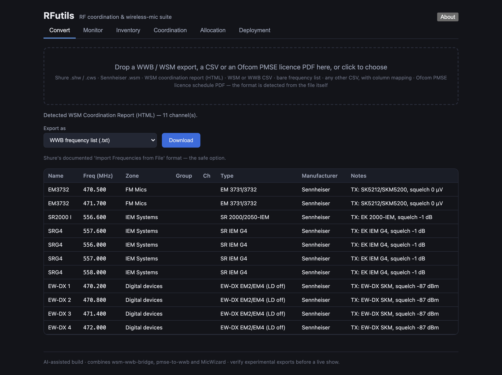
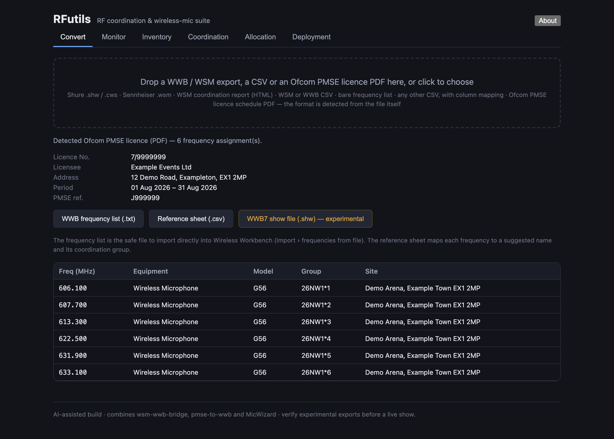

# RFutils user guide

RFutils is **a browser-based toolkit for radio-mic frequency coordination**. It replaces three
separate tools with one app: file conversion between Shure and Sennheiser ecosystems, Ofcom PMSE
licence import, live receiver monitoring, intermodulation-clean coordination, allocation, and
programming receivers.

> **Before you rely on this for a show:** most of the file formats RFutils reads and writes are
> *reverse-engineered from real exports*, because neither Shure nor Sennheiser publishes full
> specifications for them. **Open every export in your own copy of Wireless Workbench or WSM and
> check it before the show.** Treat anything marked experimental as exactly that.

---

## The tabs

| Tab | What it's for | Needs the local app |
|---|---|---|
| **Convert** | Move coordination data between Shure Wireless Workbench (WWB) and Sennheiser Wireless Systems Manager (WSM), in and out of plain CSV, or turn an Ofcom PMSE licence schedule PDF into importable frequency data — one drop zone, the file's type is detected | no |
| **Inventory** | Keep a list of the receivers and transmitters you own | no |
| **Coordination** | Calculate an intermodulation-clean set of frequencies | no |
| **Allocation** | Work out which frequencies go to which channel | no |
| **Monitor** | Discover Shure/Sennheiser/AES67 receivers and watch audio, battery and RF | **yes** |
| **Deployment** | Push assignments out to real receivers | **yes** |

> **Monitor and Deployment need sockets a browser tab cannot open**, so they only appear in the
> desktop/self-hosted build. The hosted version at
> [rfutils.stoatworks-labs.com](https://rfutils.stoatworks-labs.com) runs everything else entirely
> on your own machine — nothing you load is uploaded anywhere.

---

## Running it

### As a desktop app

RFutils ships as a tray application (built on av-launcher, with a Node runtime embedded). Start
it, pick a network interface and port, press **Start**, then **Open**.

> **On macOS, if the app opens but the server never starts:** this is almost always Gatekeeper —
> though it should no longer happen with a released build, since the `.dmg` and `.pkg` are
> Developer ID-signed and notarised. On a copy you built yourself, or an older download, the trap
> is that approving the *app* does not unquarantine the *helpers* bundled inside it; they are
> terminated silently, with no error shown. `xattr -dr com.apple.quarantine` on the whole bundle
> clears it.

### From source

```bash
npm install
npm run dev
```

Then open **http://localhost:8420**.

**No hardware? Use demo mode:**

```bash
npm run dev:demo
```

This runs with simulated receivers, so you can explore discovery, monitoring and the whole UI
without a single real device on the network. It is also the fastest way to tell an app problem
from a network problem.

---

## Converting a coordination file

1. Go to **Convert**.
2. Drop in your `.shw`/`.cws`, WSM export or CSV. The format is detected automatically — there
   is nothing to choose first, and the same zone takes a licence PDF (next section).
3. For a plain CSV, RFutils reads the header and suggests which column is which. **Check the
   suggested mapping** — it is a best guess from the column names. If it could guess nothing,
   the table starts empty and fills in as you map the name and frequency columns.
4. Choose your export format and download.
5. **Open the result in WWB or WSM and confirm it looks right** before using it.



---

## Importing an Ofcom PMSE licence

1. Go to **Convert**.
2. Drop in the licence schedule PDF exactly as Ofcom issued it. RFutils recognises a PDF from its
   contents, so it doesn't matter what the file is called or whether it still has its `.pdf`
   extension.
3. If you get *"No frequency assignments were found in this PDF"*, the file was readable but
   isn't the expected document — check you have uploaded the schedule itself rather than a
   covering letter or a re-saved copy.
4. Export to your coordination software.



This parser **has been validated against a real Ofcom licence**, which is more than can be said
for most of the formats here.

---

## Coordination

Computes a set of mutually-compatible frequencies — spaced, clear of excluded spectrum, and free
of third and fifth-order intermodulation products.


Pick an **equipment profile** and a **band preset** and the spacing defaults follow from the
profile — the note under the selector states the occupied bandwidth and recommended spacing it is
assuming, and tells you to verify it against your own unit.

**Locked / existing** is the field that matters on a site where somebody else is already on air:
frequencies you put there are treated as immovable and everything else is coordinated around
them.

---

## Inventory

The receivers and transmitters you own, so coordination and allocation have something real to work
against.


> **Saving inventory replaces the whole list** rather than merging into it — the app always writes
> the complete set.

---

## Monitor

Discovers Shure, Sennheiser and AES67/Dante receivers on the local network and meters audio,
battery and RF per channel in real time.


*Captured against `npm run dev:demo`, so the receivers are simulated.*

If nothing appears: RFutils and the receivers must be on the same subnet, discovery must not be
blocked by a firewall, and the wireless network must not be isolating clients from each other.

**Dante routing is off unless you set it up.** RFutils only monitors by default; routing channels
from here needs your own Bitfocus Companion with a "Make Crosspoint" button and a
`companion-routes.json` in `~/.rfutils/`. The panel says so when it is not configured.

---

## Deployment — read this before you press it

**Deployment sends commands to real receivers, which may be in use.**


**Dry-run** shows exactly what would be transmitted — the address, the literal command string,
and "would send" against each one — without transmitting anything. **Program devices** is the
separate, deliberately distinct button that actually sends.

> **Live Shure programming is experimental and untested against hardware.** The dry-run output
> exists so you can check the exact command strings against your receiver's own Command Strings
> PDF before sending. Do that.

Supported control transports today are Shure command strings and the Lectrosonics network
protocol. Devices matching neither are listed with no transport and will not be programmed. The
same screen also exports files for offline programming, which is the safe route.

---

## Troubleshooting

| Symptom | Cause |
|---|---|
| **Nothing is discovered in Monitor** | Same subnet, firewall, or client isolation on wireless. Run `npm run dev:demo` — if simulated devices appear, the app is fine and the problem is the network. |
| **Monitor and Deployment tabs are missing** | You are on the hosted build. Those two need the local app. |
| **A CSV imports with the wrong values in the wrong fields** | The column mapping guessed wrong. Re-import and set it by hand. |
| **An export doesn't look right in WWB/WSM** | Expected occasionally — these formats are reverse-engineered. Please report it with a sample file. |
| **Coordination returns fewer frequencies than asked for** | The constraints are unsatisfiable in that range. Widen the tuning ranges, reduce spacing, or drop 5th-order avoidance. |
| **Frequencies clash with someone already on air** | Put theirs in **Locked / existing** and coordinate again. |
| **The port is already in use** | Set `RFUTILS_SERVER_PORT` to something else. |
| **I just want the converters** | Set `RFUTILS_DISABLE_MONITOR=1`, or run `npm run dev:verify`. |

---

## Where your data lives, and who can reach it

Inventory is stored server-side in the local app.

> **There is no authentication, and the server listens on all interfaces by default.** On a shared
> or untrusted network, bind it to `127.0.0.1` or firewall the port — otherwise anyone who can
> reach it can read your inventory and **send commands to your receivers**.

---

## See also

- [README](../README.md) — what it is, the three tools it replaces, and downloads
- [wsm-wwb-bridge](https://github.com/stoatworks-labs/wsm-wwb-bridge) — the standalone Python
  predecessor of the conversion tab
